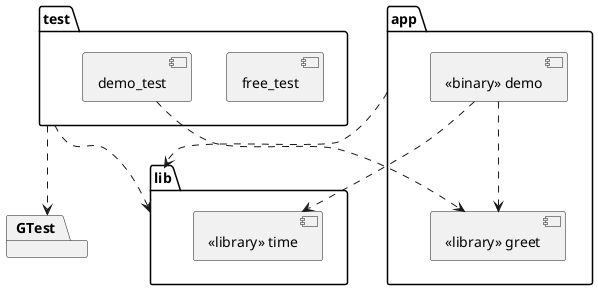

# Introduction

The goal of this example is to show how to create Bazel packages and how to build binary libraries and executables from C++ source code.

It also shows how to import external dependencies, such as GoogleTest which is used for the example unit tests.

The code is organized as follows:

```
.
├── MODULE.bazel
├── WORKSPACE
├── WORKSPACE.bzlmod
├── app
│   ├── BUILD
│   ├── .h / .cpp
├── bzl
│   ├── BUILD
│   ├── .bzl / .bazel
├── lib
│   ├── BUILD
│   ├── .h / .cpp
└── test
    ├── BUILD
    ├── demo_test.cpp
    └── free_test.cpp
```

The examples can be built using the two mechanisms offered by bazel to handle dependencies, i.e. WORKSPACE and Bzlmod.

The files WORKSPACE and MODULE mark the boundaries of the Bazel repo and also declare the dependencies.

The folder `bzl` is used to avoid making monolithic WORKSPACE and MODULE files, hence achieving modularization of the Bazel files.

The folders `app`, `lib`, and `test` contain the C++ source code with the needed BUILD files to define the build rules.

In particular,

- `lib` implements a public library that gets the local time.
- `app` implements a private library that generates a greeting and a binary that uses the time and greeting libraries.
- `demo_test.cpp` implements a unit test made with GTest that exercises the greet library exported by `app`.
- `free_test.cpp` implements an independent unit test made with GTest that does not use `app` nor `lib`.



# Bazel concepts 

## Bazel management of dependencies

Bazel can import dependencies using any of the following rules:

- http_archive: Downloads a Bazel repository as a compressed archive file, decompresses it, and makes its targets available for binding.
- git_repository: Clones a Git repository, checks out the specified tag, branch, or commit, and makes its targets available for binding.
- local_repository: Makes a local directory that already contains Bazel files available as a repo.

As a complement to the previous rules, Bazel offers some useful variants for importing non-Bazel dependencies:
- new_git_repository: Same as git_repository, but for target repositories which are not set up using Bazel. In this case, additional build rules need to be declared to make its targets available for binding.
- new_local_repository: Same as local_repository, but for target repositories which are not set up using Bazel. In this case, additional build rules need to be declared to make its targets available for binding.

The WORKSPACE mechanism can use any of these rules to import dependencies. Nevertheless, these rules do not handle transitive dependenceis, so for each imported dependency, it is required to also import all of its dependencies. This means that the WORKSPACE file needs to declare rules to import all the transitive dependencies needed to build the repo.

In contrast to the WORKSPACE mechanism, the newer Bzlmod mechanism offers a complete module management system, where each module declares a target to be imported as well as its own dependencies, i.e. other modules. When Bzlmod is used, Bazel can automatically import and build all transitive dependencies. In order to work, Bzlmod needs the so-called Bazel Central Registry where each dependency has a module with the required metadata to download itself and its dependencies.

Bzlmod relies on a single rule to import dependencies:

- bazel_dep: Declares a direct dependency on another Bazel module. No URL needs to be provided, only the name of the module. By default, Bzlmod accesses the Bazel Central Registry to fetch the module metadata and perform the actual downloading.

Only this rule needs to be used to declare dependencies. Nevertheless, if any dependency needs to be overriden by a local copy, instead of being downloaded, then the following rules are also available:

- archive_override: Specifies that this dependency should come from an archive file (zip, gzip, etc) at a certain location, instead of from a registry.
- git_override: Specifies that a dependency should come from a certain commit of a Git repository.
- local_path_override: Specifies that a dependency should come from a certain directory on local disk.

## Bazel versions vs. WORKSPACE/Bzlmod

>[!warning] The WORKSPACE mechanism will be disabled by default in Bazel 8 (late 2024) and will be removed in Bazel 9 (late 2025).

When the option enable_bzlmod is true, Bazel uses MODULE.BAZEL and WORKSPACE.bazel files and ignores WORKSPACE.

When the option enable_bzlmod is false, Bazel ignores MODULE.bazel/WORKSPACE.bazel files and uses WORKSPACE instead.

Bazel 6 has the bzlmod disabled by default, so you need to add te option `--enable_bzlmod` to use Blzmod approach.

Bazel 7 has the bzlmod enabled by default, so you need to add te option `--noenable_bzlmod` to use the WORKSPACE approach..


# Build and run the demo binary (Bazel targets without dependencies)

The `app` and `lib` packages define targets that are not dependant on external modules, so they can be built alone.

```
├── app
│   ├── BUILD
│   ├── greet.cpp
│   ├── greet.h
│   └── main.cpp
├── lib
│   ├── BUILD
│   ├── time.cpp
│   └── time.h
```

1) The folder `lib` implements a Bazel package called `lib` which has the C++ source code to build a library called `time` that can be imported by other rules.

Run the following command to build the library `time`:

```
bazel build //lib:time
```

The library is built in two flavours: static and dynamic (libtime.a and libtime.so).

To make other Bazel rules dependant on this library, use the moniker `//lib:time`.

2) The folder `app` implements a Bazel package called `app` which has the C++ source code to build a library called `time` and an executable called `demo`.

Run the following command to build the library `greet`:

```
bazel build //app:greet
```

The library is built in two flavours: static and dynamic (libgreet.a and libgreet.so).

Run the following command to build and run the executable `demo`:

```
bazel run //app:demo
```

The executable depends on both libraries, the internal ":greet" and the external `//lib:time`.


# Build and run the unit tests using the WORKSPACE mechanism

When using the WORKSPACE mechanism, the dependencies are declared in the WORKSPACE file.

The WORKSPACE file of this repository declares rules to import the needed direct dependencies as well as their transitive dependencies.

The following third-party dependencies will be used as examples:

- Buildifier
- Rules CC
- Catch2
- GoogleTest

1) The first example builds a simple GTest, called FreeTest and implemented in `test/free_test.cpp`, which runs a simple unit test without defining any explicit C++ class.

1.a) Run the following command to build and run FreeTest using the rule `http_archive` to import  GoogleTest.

```
bazel test //test:http_free_test --noenable_bzlmod
```

1.b) Run the following command to build and run FreeTest using the rule `git_repository` to import GoogleTest.

```
bazel test //test:git_free_test --noenable_bzlmod
```

1.c) Run the following command to build and run FreeTest using the rule `local_repository` to import GoogleTest.

```
mkdir -p ~/.local/tmp/
rm -rf g~/.local/tmp/googletest
git clone https://github.com/google/googletest.git ~/.local/tmp/googletest
ln -s ~/.local/tmp/googletest googletest
bazel test //test:local_free_test --noenable_bzlmod
```


# Build and run the unit tests using the Bzlmod mechanism

When using the Bzlmod mechanism, the dependencies are declared in the MODULE file.

The MODULE.bazel file of this repository declares rules to import the needed direct dependencies. The transitive dependencies are handled automatically by Bzlmod, so there is no need to declare them.

1) The first example builds a simple GTest, called FreeTest and implemented in `test/free_test.cpp`, which runs a simple unit test without defining any explicit C++ class.

1.a) Run the following command to build and run FreeTest using the rule `http_archive` to import  GoogleTest.

```
bazel test //test:http_free_test
```

1.b) Run the following command to build and run FreeTest using the rule `git_repository` to import GoogleTest.

```
bazel test //test:git_free_test
```

1.c) Run the following command to build and run FreeTest using the rule `local_repository` to import GoogleTest.

```
mkdir -p ~/.local/tmp/
rm -rf ~/.local/tmp/googletest
git clone https://github.com/google/googletest.git ~/.local/tmp/googletest
ln -s ~/.local/tmp/googletest googletest
bazel test //test:local_free_test
```

1.d) Run the following command to build and run FreeTest using the rule `bazel_dep` to import GoogleTest.

```
bazel test //test:dep_free_test
```

2) The second example builds a simple GTest, called DemoTest and implemented in `test/demo_test.cpp`, which runs a simple unit test that exercises the C++ function `get_greet` defined in `app/greet.cpp`.

Run the following command to build and run DemoTest using the rule `bazel_dep` to import GoogleTest.

```
bazel test //test:dep_demo_test
```

